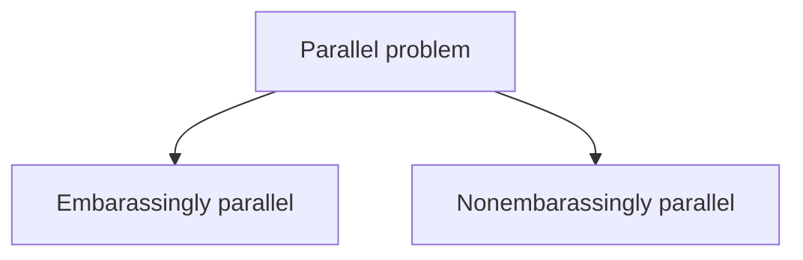
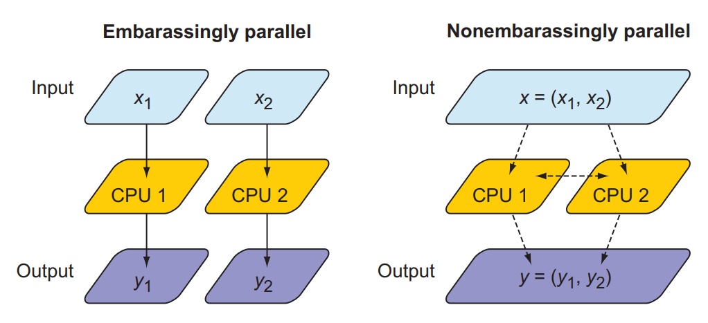

## Fortran notes

- statically typed: variable types are declared and known to the compiler during compile time. And remains that way till the end of the program.
- manifest typing: variable times are explicitly typed before their use 

> A statically typed language has a type system that is checked at compile time by the implementation (a compiler or interpreter).


```fortran
x = 10.2 ! implicit typing (type automatically inferred by compiler like in python)
integer :: x ! explicit typing (compiler is told what the type is)
x = 10.2 
```
- strong typing: compiler raise error if procedure is invoked with arguments of wrong type
- multiparadigm: Fortran can be written in multiple paradigms/styles - imperative, procedural, object-oriented, and functional
- parallel: Fortran's a parallel language
> Paralellism: ability to split the computational problem between processes that communicate through a network
> > parallel process can be running on same core (thread-based parallelism), different cores sharing the same RAM (shared-memory parallelism), or distributed across the network (distributed-memory parallelism)

`coarray` is a data structure in fortran which allows parallel programming.

"A coarray in Fortran is a built-in parallel programming feature that lets you write multi-image (multi-process)"

- mature: released in 1957.
- fortran excels in its niche domain: High Performance Computing (HPC) and it's computational efficiency is unparalleled, with C and C++ coming close.
> High-performance computing (HPC) is the practice of combining computer resources
to solve computational problems that would otherwise not be possible with a single
desktop computer. HPC systems typically aggregate hundreds or thousands of servers and connect them with fast networks. Most HPC systems today run some flavor
of Linux OS.

### Features of fortran that makes it indispensable

- Array oriented: provides whole-array arithmetic and operations, greatly simplifying element-wise operations.

```c
// multiplying a 2D array in C
for (int i = 0; i < n; i++){
    for (int j = 0; j < m; j++){
        c[i, j] = a[i, j] * b[i, j];
    }
}
```
```fortran
! Multiplying a 2D array in fortran
c = a * b
```
- developed to support its target audience: computational scientists and engineers.
- mature libraries for science, engineering and maths: started in the 1950s as programming language for science, engineer and math. Has rich legacy of robust and trusted libraries for **linear algebra**, **numerical differentiation and integration**, and other mathematical problems. Libraries also tested by generations of programmers, so mostly bug-free.
- Growing general purpose library ecosystem
- Unmatched performance: due to it having an array-oriented design and its mature compilers that continuously improve at optimizing code.

In summary, learn Fortran if you need to implement efficient and parallel numerical
operations on large multidimensional arrays. 

### Advantages and disadvantages

- Domain-specific language: desgined for science, engineering and math. If the problem involves some arithmetic on large and unstructured arrays, then fortran will shine. If you wanna write a web browser or low-level device drivers, it's not the right tool.
- Niche language: extremely important to a relatively small number of people: scientists and engineers in select discplines. So hard to find resources
- Statically and strongly typed language: makes it a very safe and efficient language but also very verbose and less flexible, so not ideal for rapid prototyping.

> Python is used by many Fortran programmers for postprocessing of model output and data analysis. Python was developed in 1991. Fortran in 1957.
> Fortran is a **natively parallel programming language**, this is only possible with external libraries in python, making it more difficult.

> **Moore's Law**:
> Gordon Moore, cofounder of Intel, noticed in 1965 that the number of transistors
in a CPU was doubling each year. He later revised this trend to doubling every two
years. Nevertheless, the rate of increase is exponential and closely related to a
continuous decrease in the cost of computers. A computer you buy today for
$1,000 is about twice as powerful as one you could buy for the same amount two
years ago.

## Parallel Programming in Fortran

Parallel problems fall into 2 categroies:


---
**What is a process?** A program in execution. 

**What is a processor?** A processor or CPU (Central Processing Unit) is a hardware device that interprets and executes instructions from hardware and software.

**What is a core?** A CPU is made up of 1 or more cores which consists of processors. A core is essentially a processor in a CPU that combine with other cores to form the CPU. Like a chef(core) in a kitchen(CPU), there can be 1 or more chefs working on a recipe(process) independently and at the same time to deliver a meal(result of process).

Most laptops have 1 CPU with 2 to 4 cores.

---
Parallel processing is when you take a single process, a big computational problem and divide it into smaller subprobelms/subporcesses known as **threads** or **images** in fortran, which run independently and concurrently.

1. **Embarassingly parallel** (*Embarassingly easy to run parallel*): Problems where each part can run completely independent, with no need of communication between tasks. `Split process into subprocesses and run independently and concurrently` *eg. Rendering different frames of an animation
*
>  Because the domain decomposition of embarrassingly parallel problems is trivial, modern compilers can often autoparallelize such code.

2. **Nonembarassingly parallel**: Any parallel problem with inderdependency between process requires **communication** and **synchronization**. `Problems require communcation or coordination between processes.`. *eg. Simulating heat flow in a 2D grid (neighbor cells affect each other)*
   
>  Most PDE solvers are nonembarrassingly parallel. The amount of communication vs. computation dictates how well a parallel
problem can scale. The objective for most physical solvers is thus to minimize communication and maximize computation.



Parallel Fortran programming in the past has been done either using the OpenMP directives for shared-memory computers only, or with the Message Passing Interface (MPI) for both shared and distributed memory computers.

## Shared Memory vs Distributed Memory

