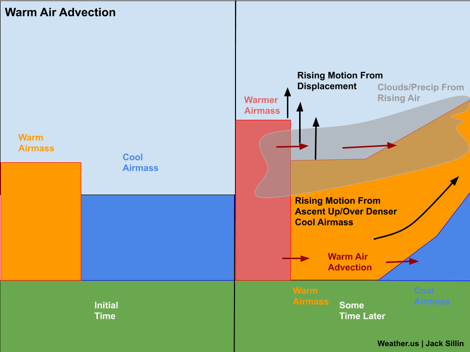

# Advection

The transfer of heat, matter of some physical quantity from one point to another through a fluid, due to the movement of the fluid itself. 

Take the ocean, for example. When parts of the ocean warm faster than their surroundings due to **differential heating**, the air above the warmer region absorbs heat by **conduction** and rises. This rising air creates a **low-pressure region** at the surface. Because of the pressure difference between this low-pressure region and the surrounding **(relatively) high-pressure regions**, a **pressure gradient force (PGF)** is established. This force causes air to move from the high-pressure area toward the low-pressure area. The horizontal movement of air is what we call **wind**.

Wind, in turn, transports heat horizontally through the atmosphere, which is a **fluid**. This horizontal transfer of heat by the movement of air is known as **advection**.

> Background flow is the steady or prescribed velocity field of a fluid in which other things happen — like advection, waves, turbulence, or reactions.

***reference***: [https://www.youtube.com/watch?v=yJrrOFYfUVQ](https://www.youtube.com/watch?v=yJrrOFYfUVQ)

## Linear advection

Let $u(x, t)$ be the physical quantity (like temperature, density, etc.), and $c$ is the velocity of the flow, then

$$\frac{\partial u}{\partial t} + c \frac{\partial u}{\partial x} = 0$$

$\frac{\partial u}{\partial t}$ tells us how the rate of change of the particular quantity (how it changes with time). 

> Essentially, when we take $\frac{\partial u}{\partial t}$, we're concerned with how *fast* is that quantity changing at a fixed point. $\frac{\partial u}{\partial x}$ tells us how much of that quantity is changing with every unit distance and $c$ is the speed/velocity of the **background flow**.

The advection equation predicts the change of any quantity due to the spatial gradient of that quantity and the background flow.

## Real-life scenario

